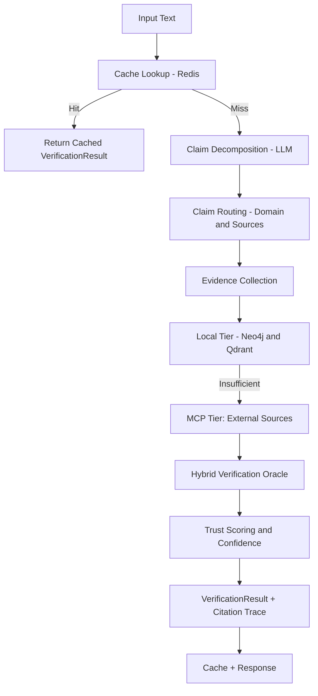
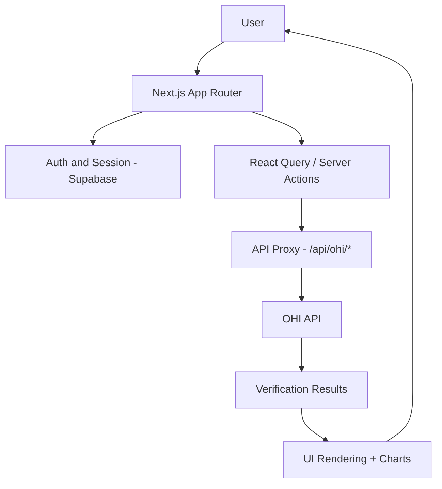
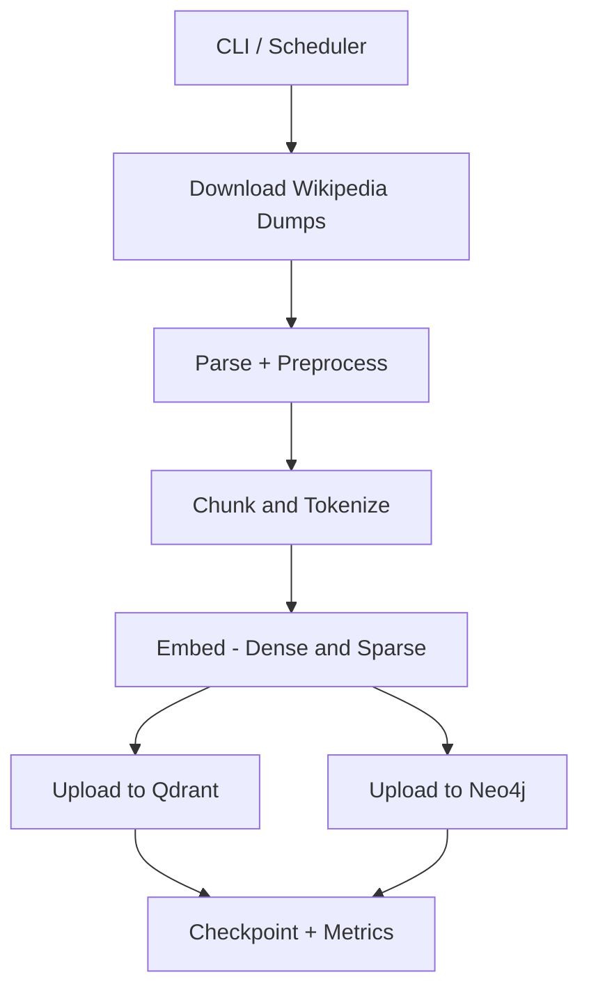
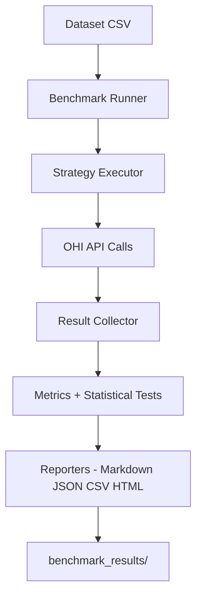

<p align="center">
  
</p>

<h1 align="center">Open Hallucination Index</h1>

<p align="center">
  <strong>🔍 Scientifically grounded real-time fact-checking for LLM outputs</strong>
</p>

<p align="center">
  <a href="#project-overview">Project Overview</a> •
  <a href="#documentation">Documentation</a> •
  <a href="#subsystem-guides">Subsystem Guides</a> •
  <a href="#project-structure">Structure</a> •
  <a href="#getting-started">Getting Started</a> •
  <a href="#contributing">Contributing</a>
</p>

<p align="center">
  
  
  <a href="https://github.com/shiftbloom-studio/open-hallucination-index/actions"></a>
</p>

---

**Open Hallucination Index (OHI)** is a high-performance middleware and analysis platform that decomposes LLM outputs into atomic claims, verifies them against curated knowledge sources, and calculates a traceable trust score in real-time. The focus is on reproducible, evidence-based hallucination detection with clear interfaces for research, production use, and auditability.

## 🧭 Project Overview

OHI combines **Claim Decomposition**, **Multi-Source Evidence Retrieval**, and **Quantitative Trust Scoring Models**. The architecture follows a hexagonal design, ensuring that knowledge sources, scoring strategies, and retrieval pipelines remain interchangeable. The system consists of:

- **API (FastAPI):** Orchestrates verification, evidence aggregation, and scoring.
- **Knowledge Track API:** Provides provenance, source lists, and 3D mesh data for claims.
- **Frontend (Next.js):** A scientifically oriented UI for analysis, traceability, and reporting.
- **Infrastructure Layer:** Neo4j, Qdrant, Redis, and MCP sources for external evidence.

## 📚 Documentation

Detailed documentation is stored in the docs folder:

- [docs/CONTRIBUTING.md](docs/CONTRIBUTING.md) – Contribution guidelines, conventions, and review process
- [docs/CODE_OF_CONDUCT.md](docs/CODE_OF_CONDUCT.md) – Community standards
- [docs/PUBLIC_ACCESS.md](docs/PUBLIC_ACCESS.md) – Public access and usage framework
- [docs/API.md](docs/API.md) – Full API specification, models, examples
- [docs/FRONTEND.md](docs/FRONTEND.md) – UI architecture, page structure, design principles
- [docs/CLASSIFICATION_IMPROVEMENTS.md](docs/CLASSIFICATION_IMPROVEMENTS.md) – Evidence classification improvements and deployment
- [docs/CLASSIFICATION_CONFIG.md](docs/CLASSIFICATION_CONFIG.md) – Classification configuration guide with profiles

## 🧭 Subsystem Guides

Use these for deep, project-specific details and operational tips:

- [src/api/README.md](src/api/README.md) – Verification API, filters, caching, strategies, knowledge-track
- [src/ohi-mcp-server/README.md](src/ohi-mcp-server/README.md) – MCP server, tools, routing, and ops
- [gui_benchmark_app/README.md](gui_benchmark_app/README.md) – Benchmark suite, metrics, and reports
- [gui_ingestion_app/README.md](gui_ingestion_app/README.md) – Wikipedia ingestion pipeline and tuning
- [src/frontend/README.md](src/frontend/README.md) – Frontend architecture, data flows, and UI
- [docker/README.md](docker/README.md) – Full stack Docker orchestration and service map

## ✨ Features

| Feature | Description |
|---------|-------------|
| **🧠 Claim Decomposition** | Breaks text into verifiable atomic claims using LLM-powered extraction |
| **📊 Multi-Source Verification** | Validates against Neo4j graph, Qdrant vectors, and MCP sources |
| **⚡ High Performance** | Session pooling, batch processing, parallel verification, Redis caching |
| **🧭 Adaptive Evidence** | Adaptive strategy balances speed and coverage with tiered retrieval |
| **🎯 Trust Scoring** | Evidence-ratio based scoring with confidence intervals (0.0 - 1.0) |
| **🧩 Knowledge Track** | Source‑aware provenance and 3D‑mesh graph for each verified claim |
| **🔌 Pluggable Architecture** | Hexagonal design - easily swap knowledge sources and strategies |

## 🧬 Project Workflows

### API Verification Workflow



### Frontend Workflow



### Ingestion Workflow



### Benchmark Workflow



### MCP Server Workflow

```mermaid
flowchart TD
  A[MCP Client] --> B["Transport - SSE STDIO"]
  B --> C["Rate Limiter and Cache"]
  C --> D[Tool Router]
  D --> E[Source Adapters (Parallel)]
  E --> F["Normalize and Aggregate"]
  F --> G[Response Payload]
```

## 📁 Project Structure

```
open-hallucination-index/
├── src/
│   ├── api/                # Python FastAPI Backend
│   │   ├── src/            # Main source code
│   │   │   └── open_hallucination_index/
│   │   │       ├── domain/ # Core entities (Claim, Evidence, TrustScore)
│   │   │       ├── ports/  # Abstract interfaces
│   │   │       ├── application/ # Use-case orchestration
│   │   │       ├── adapters/    # External service implementations
│   │   │       ├── infrastructure/ # Config, DI, lifecycle
│   │   │       └── api/    # FastAPI routes
│   │   ├── tests/          # Unit & integration tests
│   │   ├── scripts/        # Utility scripts
│   │   └── pyproject.toml  # Python dependencies
│   ├── frontend/           # Next.js Frontend Application
│   │   ├── src/            # React/Next.js source code
│   │   ├── e2e/            # Playwright E2E tests
│   │   └── package.json    # Node.js dependencies
│   └── ohi-mcp-server/     # MCP Server (Node)
├── gui_ingestion_app/      # Standalone ingestion GUI + pipeline package
├── gui_benchmark_app/      # Standalone benchmark GUI + package
├── docs/                   # Documentation
│   ├── CONTRIBUTING.md     # Contribution guidelines
│   ├── CODE_OF_CONDUCT.md  # Community standards
│   └── PUBLIC_ACCESS.md    # Public access documentation
├── docker/                 # Docker assets (compose, nginx, data)
│   ├── api/                # API Dockerfile
│   ├── mcp-server/          # MCP Server Dockerfile
│   ├── compose/             # docker-compose.yml
│   └── data/                # Local storage for Neo4j/Qdrant/Redis
├── .github/                # GitHub configuration
│   ├── workflows/          # CI/CD pipelines
│   └── ISSUE_TEMPLATE/     # Issue templates
├── README.md               # This file
├── LICENSE                 # MIT License
└── SECURITY.md             # Security policy
```

## 🚀 Getting Started

### Prerequisites

- **Python 3.14+** for the API
- **Node.js 18+** for the frontend (22+ recommended)
- **Optional Docker Compose** for local/dev infrastructure (see [Infrastructure](#infrastructure))

### API Setup

```bash
cd src/api

# Create virtual environment
python -m venv .venv
source .venv/bin/activate  # On Windows: .venv\Scripts\activate

# Install with development dependencies
pip install -e ".[dev]"

# Run tests
pytest

# Start the API server
ohi-server
```

### Frontend Setup

```bash
cd src/frontend

# Install dependencies
npm install

# Run development server
npm run dev

# Run tests
npm run test
```

## 🏗️ Infrastructure

Docker Compose definitions for the full stack live in docker/compose/docker-compose.yml. For local/dev you can copy [.env.example](.env.example) to `.env` and run the compose stack:

```bash
docker compose -f docker/compose/docker-compose.yml up -d
```

### Required Services

The OHI API requires the following external services:

| Service | Purpose | Documentation |
|---------|---------|---------------|
| **Neo4j** | Graph database for structured knowledge | [neo4j.com](https://neo4j.com/) |
| **Qdrant** | Vector database for semantic search | [qdrant.tech](https://qdrant.tech/) |
| **Redis** | Caching layer (optional) | [redis.io](https://redis.io/) |
| **LLM Service** | For claim decomposition (OpenAI, vLLM, etc.) | [vllm.ai](https://vllm.ai/) |

### Configuration

Create a `.env` file at the repository root (see [.env.example](.env.example)):

```env
# API Settings
API_HOST=0.0.0.0
API_PORT=8080
API_API_KEY=your-secret-api-key

# LLM Configuration
LLM_BASE_URL=http://your-llm-service:8000/v1
LLM_MODEL=mistralai/Mistral-7B-Instruct-v0.2
LLM_API_KEY=your-llm-api-key

# Neo4j Graph Database
NEO4J_URI=bolt://your-neo4j-host:7687
NEO4J_USERNAME=neo4j
NEO4J_PASSWORD=your-neo4j-password

# Qdrant Vector Database
QDRANT_HOST=your-qdrant-host
QDRANT_PORT=6333

# Redis Cache (optional)
REDIS_HOST=your-redis-host
REDIS_PORT=6379
REDIS_ENABLED=true

# MCP Sources (optional)
MCP_WIKIPEDIA_ENABLED=true
MCP_CONTEXT7_ENABLED=true
```

### Deployment Options

You can deploy these services using:

- **Docker Compose** (included in this repo)
- **Kubernetes** (Helm charts recommended)
- **Managed Services** (Neo4j Aura, Qdrant Cloud, Redis Cloud)
- **Self-hosted** on bare metal or VMs

## 📖 API Reference

Full API documentation including request/response schemas, example calls, error concepts, and strategies can be found in [docs/API.md](docs/API.md).

## 🧪 Development

### Running Tests

**API:**
```bash
cd src/api
pytest tests/ -v
mypy src
ruff check src tests
```

**Frontend:**
```bash
cd src/frontend
npm run test
npm run lint
npm run test:e2e
```

### Verification Strategies

| Strategy | Description | Use Case |
|----------|-------------|----------|
| `mcp_enhanced` | Query external sources (Wikipedia, Context7) + local stores | **Recommended** - Most comprehensive |
| `hybrid` | Parallel graph + vector search | Fast local-only verification |
| `cascading` | Graph first, vector fallback | When exact matches preferred |
| `graph_exact` | Neo4j only | Known entity verification |
| `vector_semantic` | Qdrant only | Semantic similarity matching |
| `adaptive` | Tiered retrieval with early-exit heuristics | Balanced speed + coverage |

## 🤝 Contributing

Contributions are welcome! Please read our [Contributing Guide](docs/CONTRIBUTING.md) for details.

1. Fork the repository
2. Create a feature branch (`git checkout -b feature/amazing-feature`)
3. Commit your changes (`git commit -m 'Add amazing feature'`)
4. Push to the branch (`git push origin feature/amazing-feature`)
5. Open a Pull Request

Please also review our [Code of Conduct](docs/CODE_OF_CONDUCT.md).

## 📄 License

This project is licensed under the MIT License - see the [LICENSE](LICENSE) file for details.

## 🙏 Acknowledgments

- [FastAPI](https://fastapi.tiangolo.com/) - Modern Python web framework
- [Next.js](https://nextjs.org/) - React framework for the frontend
- [Neo4j](https://neo4j.com/) - Graph database
- [Qdrant](https://qdrant.tech/) - Vector search engine
- [MCP](https://modelcontextprotocol.io/) - Model Context Protocol

---

<p align="center">
  Made with ❤️ by the OHI Team
</p>
