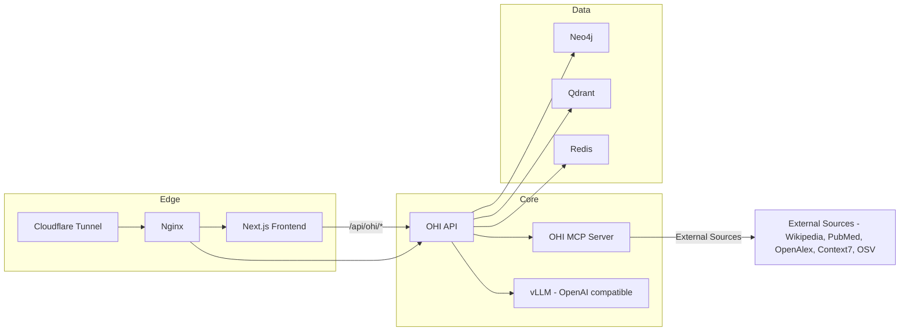

# OHI Docker Stack

Production-ready Docker assets for the Open Hallucination Index. This directory contains the full multi-service stack (API, MCP, LLM, graph, vector DB, cache, frontend, and edge services) plus infrastructure configs.

---

## What’s inside

- docker/compose/docker-compose.yml - Full stack orchestration
- docker/api/Dockerfile - API image
- docker/mcp-server/Dockerfile - MCP server image
- docker/nginx/ - Nginx reverse proxy configuration
- docker/cloudflared/ - Cloudflare tunnel image
- docker/data/ - Persistent data mounts (Neo4j, Qdrant, Redis, Certbot)

---

## Stack overview



---

## Service map

| Service | Role | Port | Notes |
|--------|------|------|------|
| Neo4j | Graph knowledge store | 7474/7687 | Localhost-only ports for dev
| Qdrant | Vector database | 6333/6334 | gRPC on 6334
| Redis | Cache + traces | 6379 | Optional but recommended
| vLLM | Local LLM | 8000 | GPU required (NVIDIA)
| OHI MCP | External knowledge sources | 8083→8080 | Aggregated MCP tools
| OHI API | Verification orchestration | internal 8080 | Reverse-proxied by Nginx
| Frontend | Next.js app | internal 3000 | Reverse-proxied by Nginx
| Nginx | Reverse proxy + TLS | 80/443 | Serves API + UI
| Cloudflared | Tunnel | n/a | Optional public ingress

---

## Quick start

From repo root:

```bash
# Start the full stack
docker compose -f docker/compose/docker-compose.yml up -d
```

Common dev-only services (Neo4j, Qdrant, Redis, vLLM, API, MCP, Frontend, Nginx) are all enabled in the default compose file.

---

## CI/CD

Docker images are automatically built and pushed to GitHub Container Registry on pushes to main branch and tags.

- Workflow: [.github/workflows/docker.yml](../.github/workflows/docker.yml)
- Images:
  - `ghcr.io/{repo}/api` - Built from `docker/api/Dockerfile`
  - `ghcr.io/{repo}/mcp-server` - Built from `docker/mcp-server/Dockerfile`
  - `ghcr.io/{repo}/frontend` - Built from `src/frontend/Dockerfile`
- Tags: `latest`, branch names, SHA, semantic versions

To use pre-built images, update `docker-compose.yml` image tags from `:local` to registry URLs.

---

## Key environment variables

These are read from the repo root .env:

### API
- API_API_KEY
- VERIFY_DEFAULT_STRATEGY
- VERIFY_MCP_TIMEOUT_MS / VERIFY_TOTAL_TIMEOUT_MS

### LLM (vLLM)
- HF_TOKEN (for model downloads)
- LLM_MODEL (set in compose for vLLM)

### MCP
- CONTEXT7_API_KEY
- POLITE_POOL_EMAIL

### Frontend
- NEXT_PUBLIC_SUPABASE_URL
- NEXT_PUBLIC_SUPABASE_ANON_KEY
- DEFAULT_API_URL
- DEFAULT_API_KEY

---

## Persistence

- Neo4j data: docker/data/data/neo4j
- Qdrant data: docker/data/data/qdrant
- Redis data: docker/data/data/redis
- TLS certs: docker/data/data/certbot

Tip: Keep docker/data on fast local storage to speed ingestion and query performance.

---

## Health checks

The compose stack includes health checks for:

- vLLM (http://localhost:8000/health)
- MCP (http://localhost:8080/health)
- API (http://localhost:8080/health/live)

These ensure dependencies are ready before API starts accepting traffic.

---

## Operational tips

- vLLM loads large models (30–60s). Expect delayed readiness.
- Neo4j may take several minutes after large imports.
- If MCP sources are slow, increase VERIFY_MCP_TIMEOUT_MS.
- Keep Redis enabled for cache + knowledge-track features.

---

## Directory structure

```
docker/
├── api/                     # API Dockerfile
├── mcp-server/              # MCP Server Dockerfile
├── compose/                 # docker-compose.yml
├── nginx/                   # Reverse proxy configs
├── cloudflared/             # Tunnel Dockerfile
└── data/                    # Persistent volumes
```

---

## Troubleshooting

- If GPU isn’t detected, ensure NVIDIA Container Toolkit is installed.
- If vLLM fails, confirm HF_TOKEN is set and model name is valid.
- If API can’t reach MCP, check ohi-mcp-server health and network.
- If frontend can’t reach API, verify DEFAULT_API_URL and Nginx config.

---

## Related docs

- Root docs: [README.md](../README.md)
- API: [src/api/README.md](../src/api/README.md)
- MCP server: [src/ohi-mcp-server/README.md](../src/ohi-mcp-server/README.md)
- Frontend: [src/frontend/README.md](../src/frontend/README.md)
- Ingestion: [src/ingestion/README.md](../src/ingestion/README.md)
- Benchmark: [src/benchmark/README.md](../src/benchmark/README.md)
