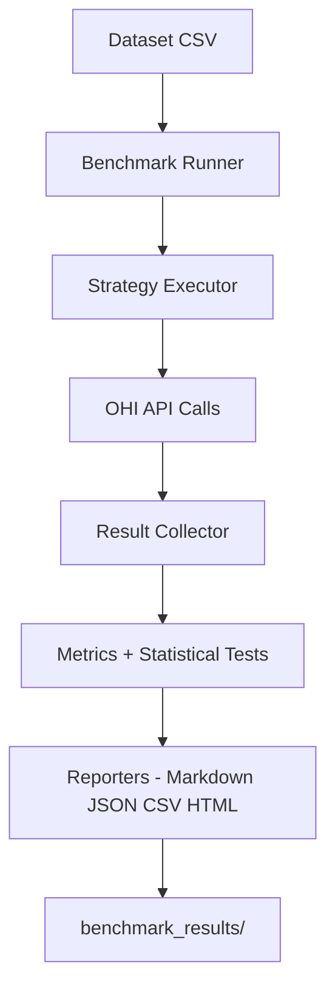
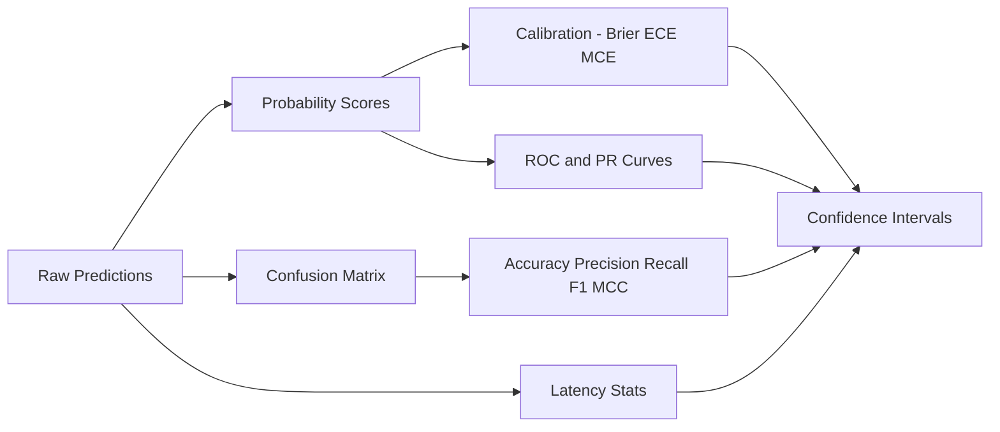

# OHI Benchmark Suite

Research-grade benchmark for evaluating hallucination detection performance of the **Open Hallucination Index (OHI)** API against VectorRAG and GraphRAG systems. This suite focuses on accuracy, calibration, latency, and statistical significance across multiple verification strategies.

---

## Highlights

- **🧪 Multi-Strategy Comparison**: Vector, Graph, Hybrid, Cascading, MCP Enhanced, Adaptive
- **📊 Statistical Rigor**: Bootstrap CIs, DeLong ROC-AUC, McNemar, Wilson intervals
- **📈 Full Metrics Stack**: Classification, calibration, curves, latency percentiles
- **📝 Multi-Format Reports**: Console, Markdown, JSON, CSV, HTML

---

## End-to-end workflow



### Metric computation pipeline



---

## Strategies under test

- **vector_semantic**: Qdrant-only semantic similarity
- **graph_exact**: Neo4j-only exact graph matching
- **hybrid**: graph + vector in parallel
- **cascading**: graph first, vector fallback
- **mcp_enhanced**: MCP sources first, local fallback
- **adaptive**: tiered local-first with early-exit heuristics

Tip: Use **adaptive** for best coverage, **graph_exact** for lowest latency, and **hybrid** for balanced recall.

---

## Installation

```bash
# From the project root
pip install -e gui_benchmark_app/benchmark/

# Or with development dependencies
pip install -e "gui_benchmark_app/benchmark/[dev]"
```

---

## Usage

### Command line

```bash
# Run with default settings
python -m benchmark

# Specify strategies
python -m benchmark --strategies vector_semantic,mcp_enhanced

# Custom configuration
python -m benchmark --threshold 0.7 --concurrency 3 --verbose

# Full options
python -m benchmark --help
```

### GUI (standalone)

```bash
# Install GUI dependencies and run
pip install -e "gui_benchmark_app/benchmark/"
ohi-benchmark-gui
```

The GUI provides:
- Live latency, accuracy, throughput, and error plots
- Evaluator selection (including API-backed OHI tiers)
- API host/port/key configuration
- Output directory and dataset picker
- Automatic comparison charts after each run

### Programmatic API

```python
import asyncio
from benchmark import OHIBenchmarkRunner, get_config

async def run_benchmark():
  config = get_config().with_overrides(
    strategies=["vector_semantic", "mcp_enhanced"],
    threshold=0.5,
    concurrency=10,
  )

  async with OHIBenchmarkRunner(config=config) as runner:
    report = await runner.run_benchmark()
    print(f"Completed: {report.total_cases} cases")

asyncio.run(run_benchmark())
```

---

## Configuration

### Environment variables

| Variable | Description | Default |
|----------|-------------|---------|
| `OHI_API_HOST` | API host | `localhost` |
| `OHI_API_PORT` | API port | `8080` |
| `BENCHMARK_DATASET` | Path to CSV dataset | `benchmark/benchmark_dataset.csv` (relative to working directory) |
| `BENCHMARK_OUTPUT_DIR` | Output directory | `benchmark_results` |
| `BENCHMARK_CONCURRENCY` | Parallel requests | `3` |
| `OHI_CONCURRENCY` | OHI-specific parallel requests (comparison benchmark) | `2` |
| `BENCHMARK_THRESHOLD` | Decision threshold | `0.7` |
| `BENCHMARK_WARMUP` | Warmup request count | `5` |
| `BENCHMARK_TIMEOUT` | Request timeout (seconds) | `120` |
| `BENCHMARK_BOOTSTRAP_ITERATIONS` | Bootstrap iterations | `1000` |
| `BENCHMARK_CONFIDENCE_LEVEL` | Confidence level | `0.95` |

### CLI options

```
Options:
  -s, --strategies TEXT    Comma-separated strategies (default: vector_semantic,mcp_enhanced)
  --all-strategies         Test all available strategies
  -t, --threshold FLOAT    Decision threshold (default: 0.7)
  -c, --concurrency INT    Parallel requests (default: 3)
  -w, --warmup INT         Warmup requests (default: 5)
  --timeout FLOAT          Request timeout in seconds (default: 120)
  -d, --dataset PATH       Path to benchmark dataset CSV
  -o, --output-dir PATH    Output directory for reports
  --bootstrap INT          Bootstrap iterations (default: 1000)
  --confidence FLOAT       Confidence level (default: 0.95)
  --formats TEXT           Output formats (default: csv,json,markdown,html)
  -v, --verbose            Enable verbose logging
  --dry-run                Validate configuration only
  --version                Show version
```

---

## Dataset format

The benchmark expects a CSV file with the following columns:

| Column | Type | Description |
|--------|------|-------------|
| `id` | integer | Unique case identifier |
| `text` | string | The claim text to verify |
| `label` | boolean | Ground truth label (true = factual) |
| `domain` | string | Domain category (e.g., science, medical) |
| `difficulty` | string | Difficulty level (easy, medium, hard, critical) |
| `notes` | string | Optional notes |
| `hallucination_type` | string | Optional hallucination pattern |

Tip: Keep a consistent label definition (true = factual). Mixing labeling conventions will distort calibration and HPR.

---

## Output and artifacts

### Directory structure

```
benchmark_results/
├── 20241201_120000/
│   ├── report.json
│   ├── report.md
│   ├── results.csv
│   └── console.html
```

### Report contents

Each report includes:
- **Summary Statistics**: Overall performance metrics
- **Strategy Comparison**: Head-to-head with statistical significance
- **Stratified Analysis**: By domain and difficulty
- **Calibration Analysis**: Reliability diagrams
- **Error Analysis**: Misclassification patterns

---

## Operational tips

- **Warmup**: Use `BENCHMARK_WARMUP` to stabilize LLM latency before measurement.
- **Concurrency**: Keep `BENCHMARK_CONCURRENCY` below the API worker count for reproducible latency.
- **OHI load**: Use `OHI_CONCURRENCY` to cap OHI in-flight requests when the GPU is saturated.
- **Timeouts**: If MCP sources are slow, increase `BENCHMARK_TIMEOUT` to avoid biased failures.
- **Reproducibility**: Fix strategy list, thresholds, and dataset versions.
- **CI**: Use `--dry-run` for configuration validation without load.

---

## Module structure

```
benchmark/
├── __init__.py          # Public API exports
├── __main__.py          # CLI entry point
├── config.py            # Configuration management
├── models.py            # Data structures
├── metrics.py           # Metrics computation
├── runner.py            # Main orchestration
├── analysis/
│   └── statistical.py   # Statistical tests
├── reporters/
│   ├── base.py          # Abstract reporter
│   ├── console.py       # Rich console output
│   ├── markdown.py      # Markdown reports
│   ├── json_reporter.py # JSON export
│   └── csv_reporter.py  # CSV export
└── pyproject.toml       # Package configuration
```

---

## API reference (key types)

### Core classes

- `OHIBenchmarkRunner`: Main benchmark orchestrator
- `BenchmarkConfig`: Configuration container
- `BenchmarkReport`: Results container

### Models

- `BenchmarkCase`: Individual test case
- `ResultMetric`: Single verification result
- `StrategyReport`: Per-strategy results

### Metrics

- `ConfusionMatrix`: Classification metrics with MCC
- `CalibrationMetrics`: Brier, ECE, MCE
- `ROCAnalysis`: ROC curve with AUC
- `LatencyStats`: Timing statistics

### Statistical functions

- `mcnemar_test()`: Paired classifier comparison
- `delong_test()`: AUC comparison
- `bootstrap_ci()`: Bootstrap confidence intervals
- `wilson_ci()`: Wilson score interval

---

## License

MIT License - see [LICENSE](../LICENSE) for details.
