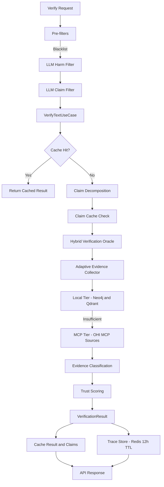

# OHI API (FastAPI)

High-performance verification API for the Open Hallucination Index (OHI). This service decomposes text into claims, collects evidence from local and MCP knowledge sources, computes trust scores, and provides knowledge provenance tracks for visualization.

## What this service does

- Decomposes text into atomic claims with an LLM-backed decomposer
- Verifies claims against Neo4j (exact graph) and Qdrant (semantic vectors)
- Augments with MCP sources (Wikipedia, PubMed, OpenAlex, Context7, OSV, etc.)
- Computes a trust score with confidence and claim-level contributions
- Stores verification traces in Redis for knowledge-track visualization
- Provides audit-friendly logs and health readiness probes

## End-to-end flowchart

## Architecture at a glance

- Hexagonal architecture with ports and adapters
- Application use cases orchestrate domain services
- Adapters provide concrete integrations (Neo4j, Qdrant, Redis, MCP, LLM)

Key modules (browse within src/open_hallucination_index):

- Application
  - VerifyTextUseCase orchestrates the full verification pipeline
  - KnowledgeTrackService builds provenance responses
- Domain services
  - LLMClaimDecomposer: LLM claim extraction with robust fallback
  - HybridVerificationOracle: multi-strategy verification
  - AdaptiveEvidenceCollector: tiered evidence collection with early exit
  - SmartMCPSelector + ClaimRouter: domain-aware source selection
  - WeightedScorer: trust scoring based on claim status and confidence
  - KnowledgeMeshBuilder: builds 3D-ready provenance meshes
- Adapters
  - Neo4jGraphAdapter: exact relationship-aware graph queries
  - QdrantVectorAdapter: semantic retrieval with hybrid payload filtering
  - OHIMCPAdapter: unified external knowledge sources
  - RedisCacheAdapter: result + claim-level caching
  - RedisTraceAdapter: knowledge-track trace storage
  - OpenAILLMAdapter: OpenAI-compatible LLM (vLLM, OpenAI, Ollama)
  - LocalEmbeddingAdapter: sentence-transformers embeddings

## API endpoints

Base prefix: /api/v1

- POST /api/v1/verify
  - Body: text, optional context, strategy, use_cache, target_sources, skip_decomposition
  - Headers: X-API-Key (if enabled), X-User-Id (optional audit logging)
- POST /api/v1/verify/batch
  - Body: texts[], strategy, use_cache
  - Concurrency-limited to 10 requests internally
- GET /api/v1/strategies
  - Returns available verification strategies
- GET /api/v1/knowledge-track/{claim_id}
  - Query: depth (1-5), generate_detail (bool)
- HEAD /api/v1/knowledge-track/{claim_id}
  - Existence check for cached trace
- GET /api/v1/knowledge-track/sources/available
  - Lists MCP source metadata

Health endpoints:

- GET /health
- GET /health/live
- GET /health/ready

OpenAPI:

- /openapi.json
- /openapi.yaml
- /docs and /redoc

## Verification strategies

Available strategies are defined in VerificationStrategy:

- graph_exact: Neo4j only
- vector_semantic: Qdrant only
- hybrid: graph + vector in parallel
- cascading: graph first, vector fallback
- mcp_enhanced: MCP first, local fallback
- adaptive: tiered local-first with early-exit (default)

Tip: For lowest latency, use graph_exact or cascading with a well-populated Neo4j. For best coverage, use adaptive or mcp_enhanced.

## Filters pipeline (pre-verification)

Order is fixed and applied to both single and batch routes:

1. BlacklistFilter: fast term check (see blacklist file)
2. LLMHarmFilter: safety screening by LLM
3. LLMClaimFilter: extracts a declarative claim or rejects ambiguous input

Blacklist sources:

- VERIFY_BLACKLIST_PATH can point to a local file
- VERIFY_BLACKLIST_URL can download a list when local file is missing

## Caching and trace storage

- Result cache key: SHA-256 hash of full input text (16 chars)
- Claim cache key: SHA-256 hash of claim text (24 chars)
- Redis is optional
  - If Redis is disabled, result caching and knowledge-track are disabled
- Knowledge-track traces are stored with 12-hour TTL

## MCP evidence routing

- ClaimRouter classifies domain and suggests sources
- SmartMCPSelector picks sources based on relevance, latency, and availability
- OHI MCP adapter supports targeted search per domain

Tip: Adjust VERIFY_MAX_MCP_SOURCES_PER_CLAIM and VERIFY_MIN_SOURCE_RELEVANCE to trade latency for coverage.

## Configuration (environment variables)

This service uses pydantic-settings. The most important configuration groups:

API
- API_HOST, API_PORT, API_WORKERS, API_DEBUG, API_API_KEY

LLM (OpenAI-compatible)
- LLM_BASE_URL, LLM_API_KEY, LLM_MODEL
- OPENAI_API_KEY is used for embeddings when required

Neo4j
- NEO4J_URI, NEO4J_USERNAME, NEO4J_PASSWORD, NEO4J_DATABASE

Qdrant
- QDRANT_HOST, QDRANT_PORT, QDRANT_COLLECTION_NAME, QDRANT_VECTOR_SIZE

Redis
- REDIS_ENABLED, REDIS_HOST, REDIS_PORT, REDIS_DB
- REDIS_CACHE_TTL_SECONDS, REDIS_CLAIM_CACHE_TTL_SECONDS

Verification
- VERIFY_DEFAULT_STRATEGY
- VERIFY_MIN_EVIDENCE_COUNT, VERIFY_MIN_WEIGHTED_VALUE
- VERIFY_HIGH_CONFIDENCE_THRESHOLD
- VERIFY_LOCAL_TIMEOUT_MS, VERIFY_MCP_TIMEOUT_MS, VERIFY_TOTAL_TIMEOUT_MS
- VERIFY_MAX_MCP_SOURCES_PER_CLAIM, VERIFY_MIN_SOURCE_RELEVANCE
- VERIFY_PERSIST_MCP_EVIDENCE, VERIFY_PERSIST_TO_VECTOR
- VERIFY_ENABLE_BACKGROUND_COMPLETION

MCP
- MCP_OHI_ENABLED, MCP_OHI_URL
- MCP_WIKIPEDIA_ENABLED, MCP_WIKIPEDIA_URL
- MCP_CONTEXT7_ENABLED, MCP_CONTEXT7_URL, MCP_CONTEXT7_API_KEY

Embeddings
- EMBEDDING_MODEL_NAME, EMBEDDING_BATCH_SIZE, EMBEDDING_NORMALIZE

## Running the API

From repo root:

- Install dependencies
- Run the server

Example (Windows PowerShell or bash):

python -m venv .venv
.venv\Scripts\activate
pip install -e "src/api[dev]"

Run via the console script:

ohi-server

Tip (Windows): If uvloop is unavailable, use uvicorn directly:

python -m uvicorn open_hallucination_index.api.app:create_app --factory --host 0.0.0.0 --port 8080

## Knowledge track workflow

- Verification traces are recorded asynchronously
- Retrieval uses Redis + optional LLM summarization
- Mesh depth defaults to 2; depth > 2 triggers mesh enrichment

Tip: Use generate_detail=false to skip LLM summarization in high-traffic or offline deployments.

## Performance and operations tips

- Preload embeddings: LocalEmbeddingAdapter is eager-loaded at startup
- Staggered startup: DI adds a small random delay to reduce MCP bursts
- Batch verification is concurrency-limited to 10 to protect downstream services
- For reproducibility, set VERIFY_DEFAULT_STRATEGY and disable background completion
- Tune timeouts if MCP services are slow (VERIFY_MCP_TIMEOUT_MS and VERIFY_TOTAL_TIMEOUT_MS)
- If Neo4j is still ingesting, expect slower readiness; health/ready reflects dependencies

## Common gotchas

- Redis disabled means knowledge-track endpoints return 404 (no traces)
- OPENAI_API_KEY is required only for embedding generation in OpenAILLMAdapter
- Qdrant collection dimension mismatch is preserved if data exists
- API key auth is optional; if API_API_KEY is empty, verification endpoints are open

## Tests and quality

From src/api:

- pytest
- mypy src
- ruff check src tests

## Related docs

- Root docs in [docs/API.md](../docs/API.md)
- Frontend integration in [src/frontend/README.md](../src/frontend/README.md)
- Ingestion pipeline in [gui_ingestion_app/README.md](../gui_ingestion_app/README.md)
- MCP server in [src/ohi-mcp-server/README.md](../src/ohi-mcp-server/README.md)
